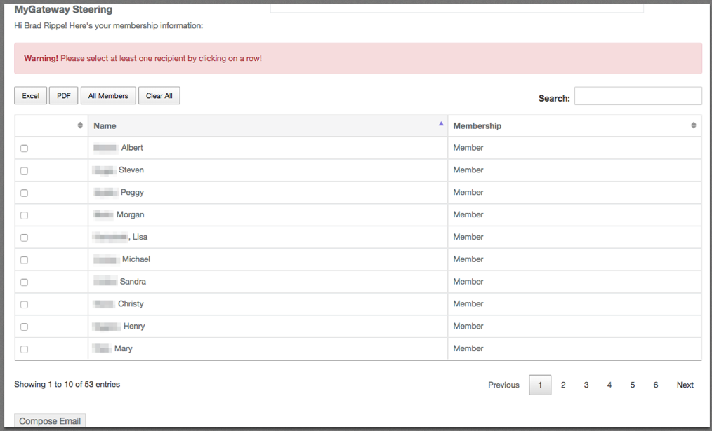

# Luminis 5/Liferay 6.2 Course/Site Email Portlet

This portlet allows users of sites/courses the ability to send email from a site/course. This can be added to a site/course page so that users may send email to others in the site/course. Users can search for recipients to add to a message, all site/course members can be displayed by name in descending or ascending order. Once recipients are selected, a message can be composed and sent.



## Building

```mvn clean package```

This will create a the war file that you can deploy in your liferay/deploy directory.

## License

This project is licensed under the MIT License - see the [LICENSE.md](LICENSE.md) file for details
